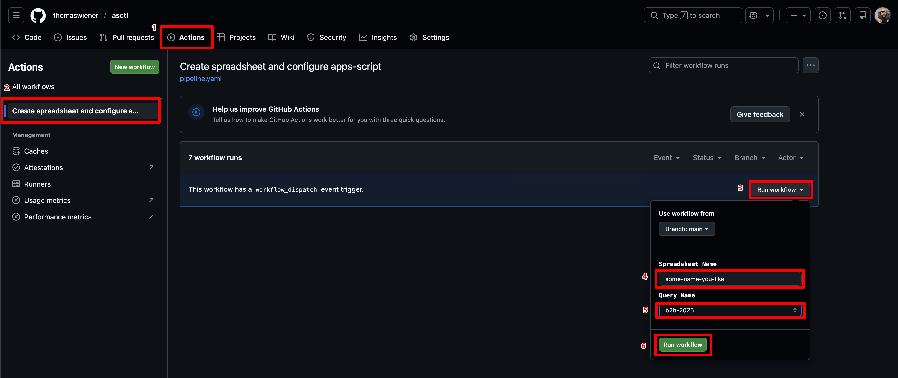
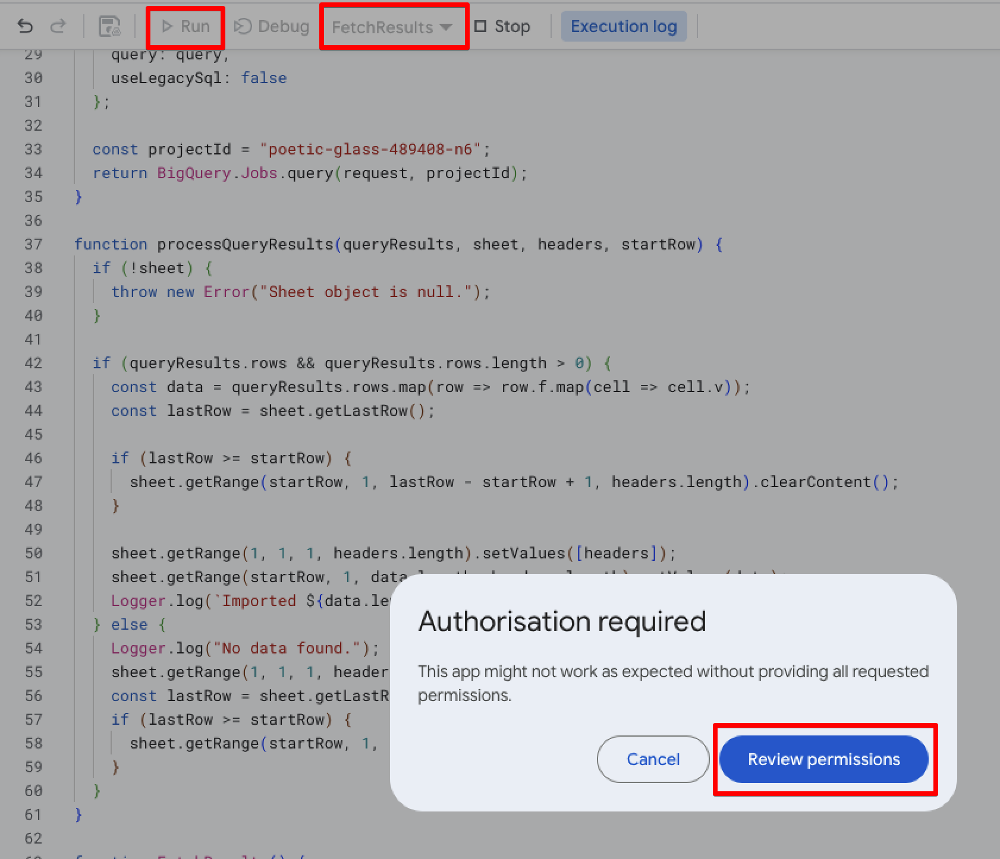
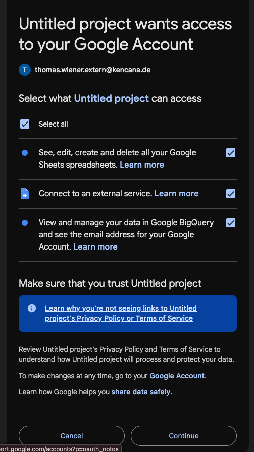
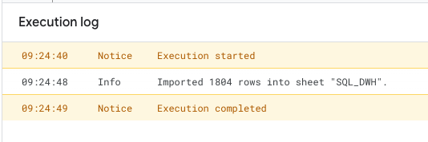
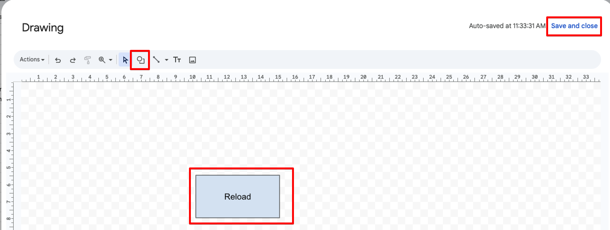
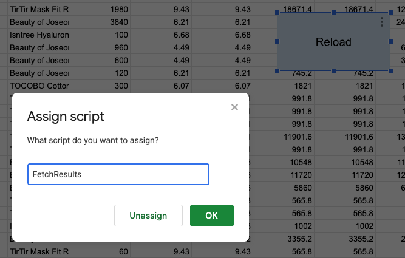
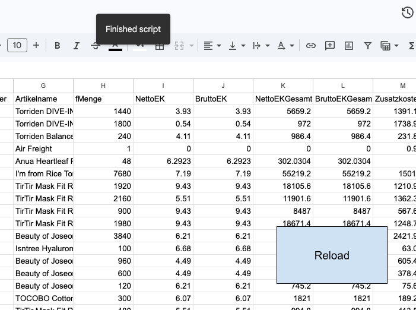

# asctl - Apps Script Control

## General

Helper script to create
- Google Spreadsheet
- Apps Script with all libraries and services attached
- Shared to colleages

## How to execute

## Test Run and authenticate

Go to Spreadsheet > Open Extension > App-Script

Select `FetchResults` and click `Run` then `Review permissions`

Then authenticate with GCP

Verify

## Setup Google Spreadsheet Action Button

At this point, you should already see data being injected in the sheet.

Now lets add a trigger button to reload the data.

Insert > Drawing

Right click on new button > 3 dots > Assign a script

Click button and wait for success message to appear `Finished script`

